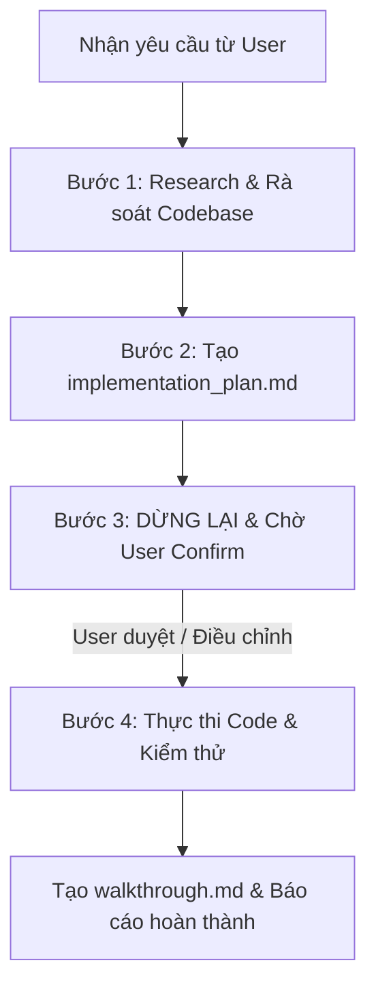

# Plan-First Skill (Strict Planning & User Confirmation)

Kỹ năng này quy định quy trình bắt buộc: **LẬP KẾ HOẠCH & XÁC NHẬN TRƯỚC KHI THỰC HIỆN** (Plan-First & User Confirmation) cho mọi tác vụ phức tạp trong toàn bộ dự án NovaTicket.

---

## 1. Khi Nào Bắt Buộc Dùng Plan-First?

Tác nhân AI **BẮT BUỘC** phải tạo file kế hoạch `implementation_plan.md`, dừng lại và chờ User xác nhận (Confirm/Approve) đối với các trường hợp sau:
1. **Thay đổi từ 2 file trở lên** (Cross-file refactoring / Multi-file changes).
2. **Thêm mới tính năng hoặc Endpoint API** (New features, new endpoints, new workflows).
3. **Thay đổi liên quan đến luồng trọng yếu**:
   - Xác thực & Phân quyền (Auth, JWT, Role-based Routing, Security).
   - Thanh toán & Vé (VNPay, Booking flow, Cancellation & Refund).
   - Cơ sở dữ liệu (Database schema, Entity, Flyway migrations, indexing).
   - AI Engine & Vector DB (Intent routing, Prompt templates, Memory state).
4. **Thay đổi kiến trúc hoặc tích hợp đa dịch vụ** (Backend ↔ Frontend ↔ AI Service ↔ Android).
5. **Các tác vụ có tính mơ hồ (Ambiguity)** hoặc có nhiều phương án kỹ thuật khác nhau cần User quyết định.

---

## 2. Quy Trình 4 Bước Chuẩn (Standard 4-Step Workflow)

### 🔹 Bước 1: Khảo sát (Research Phase)
- Chỉ sử dụng các công cụ đọc (`view_file`, `grep_search`, `find_by_name`, `list_dir`, `search_web`).
- **TUYỆT ĐỐI KHÔNG** chỉnh sửa file nguồn, tạo file code mới hoặc chạy các lệnh sửa đổi DB/code trong bước này.

### 🔹 Bước 2: Tạo Kế hoạch Chi tiết (`implementation_plan.md`)
Tạo artifact `implementation_plan.md` với đầy đủ các mục:
- **Mục tiêu (Goal & Context)**: Tóm tắt bài toán cần giải quyết.
- **Quyết định kỹ thuật & Điểm cần User lưu ý (User Review Required)**: Nêu rõ breaking changes, trade-offs.
- **Câu hỏi làm rõ (Open Questions)**: Nếu có điểm chưa chắc chắn về nghiệp vụ.
- **Danh sách file thay đổi (Proposed Changes)**:
  - `[MODIFY]` Tên file kèm đường dẫn clickable.
  - `[NEW]` Tên file mới kèm mục đích.
  - `[DELETE]` Tên file cần xóa (nếu có).
- **Kế hoạch kiểm thử (Verification Plan)**: Các lệnh test (`mvn test`, `npm run build`, `python test_agent.py`,...).

### 🔹 Bước 3: DỪNG LẠI & Chờ Xác Nhận (STOP & Wait for User Approval)
- Gửi thông báo ngắn gọn cho User xem qua bản kế hoạch và **DỪNG MỌI HÀNH ĐỘNG TIẾP THEO**.
- **KHÔNG ĐƯỢC TỰ Ý THỰC THI** cho đến khi User phản hồi đồng ý ("OK", "Proceed", "Đồng ý", "Tiến hành đi",...).

### 🔹 Bước 4: Thực thi & Báo cáo (Execute & Walkthrough)
- Thực hiện sửa đổi code theo đúng kế hoạch đã duyệt.
- Chạy toàn bộ các bài kiểm thử tự động để đảm bảo 0 lỗi hồi quy.
- Cập nhật tài liệu nghiệm thu `walkthrough.md`.

---

## 3. Khi Nào Được Phép Thực Hiện Nhanh (Fast Mode)?

Chỉ áp dụng Fast Mode (sửa trực tiếp không cần lập plan) khi:
- Sửa lỗi chính tả, typo, format code, thêm comment / docstring.
- Sửa 1 lỗi cú pháp đơn lẻ (Syntax error) hoặc 1 biến duy nhất trong 1 file.
- Trả lời câu hỏi mang tính khảo sát/tra cứu thông tin (không sửa code).
