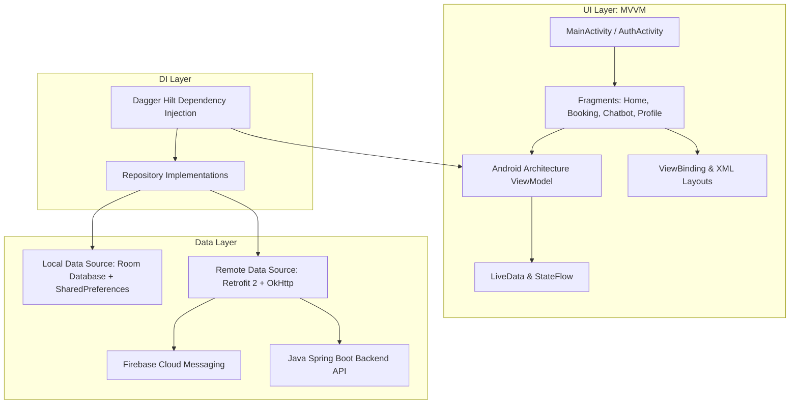

# 📱 NovaTicket Android Mobile Application

Ứng dụng di động native dành cho hệ sinh thái **NovaTicket**, được phát triển trên nền tảng **Android (Kotlin & Java 17)** theo kiến trúc chuẩn **MVVM (Model - View - ViewModel)** kết hợp với **Clean Architecture**.

---

## 🏛️ Kiến Trúc Ứng Dụng (Architecture Overview)



---

## 🚀 Tính Năng Nổi Bật

### 1. 🎟️ Đặt Vé Trực Tuyến Toàn Diện (End-to-End Booking Flow)
* **Khám phá phim**: Danh sách phim Đang chiếu & Sắp chiếu, xem Trailer, đánh giá sao và bình luận của khán giả.
* **Chọn Suất Chiếu & Cụm Rạp**: Tìm kiếm rạp gần nhất, lọc theo định dạng 2D, 3D, IMAX, ngày và khung giờ chiếu.
* **Sơ Đồ Ghế Động (Interactive Seat Map)**:
  - Hiển thị trực quan từng dãy ghế với các loại ghế: Ghế Thường, Ghế VIP, Ghế Đôi (Sweetbox).
  - Khóa giữ chỗ tạm thời với bộ đếm ngược thời gian thanh toán.
* **Combo Bắp Nước**: Tùy chọn combo bắp rang bơ, nước ngọt với giá ưu đãi.
* **Thanh Toán Đa Dạng & Bảo Mật**:
  - Thanh toán qua cổng **VNPay** (Hỗ trợ QR Pay, Thẻ ATM nội địa, Thẻ quốc tế Visa/Mastercard).
  - Thanh toán trực tiếp bằng **Ví Điện Tử NovaTicket**.
  - Áp dụng Voucher giảm giá và Đổi điểm thưởng thành viên.

### 2. 🤖 Trợ Lý Ảo AI Chatbot Thông Minh (Nova AI Assistant)
* Giao diện chat trực quan tích hợp ngay trong ứng dụng di động.
* Hỗ trợ tìm kiếm phim, tra cứu lịch chiếu, kiểm tra tình trạng ghế trống.
* Đặt vé nháp giữ chỗ tạm thời (Draft Booking) trực tiếp qua câu lệnh trò chuyện tự nhiên.
* Tự động nhận diện thời tiết tại khu vực rạp để đưa ra lời khuyên cho khán giả.

### 3. 🔔 Nhắc Lịch Chiếu & Thông Báo Đẩy (FCM Push Notifications)
* Tự động nhận thông báo khi có suất chiếu mới của bộ phim yêu thích.
* Nhắc nhở trước giờ chiếu 1 tiếng để khách hàng chủ động thời gian di chuyển.
* Nhận các chương trình khuyến mãi, voucher độc quyền theo từng phân khúc khách hàng.

### 4. 💳 Ví Vé Điện Tử & Check-in Bằng Mã QR
* Toàn bộ vé xem phim đã mua được lưu trữ trong mục **"Vé của tôi"**.
* Mã QR động dùng để quét mã trực tiếp tại cổng vào rạp mà không cần in vé giấy.
* Hỗ trợ yêu cầu hủy vé hoàn tiền/hoàn điểm tự động theo quy định của rạp.

### 5. 👑 Hệ Thống Thành Viên & Hạng Thẻ (Loyalty Tier System)
* Thanh tiến trình tích lũy điểm kinh nghiệm (Exp Bar) nâng hạng thẻ: **BRONZE ➔ SILVER ➔ GOLD ➔ DIAMOND**.
* Ưu đãi giảm giá vé và quyền lợi miễn phí đổi vé theo từng hạng thành viên.

### 6. 📱 Chế Độ Dành Cho Nhân Viên Soát Vé (Staff Scanner Mode)
* Máy quét mã QR Scanner tích hợp camera tốc độ cao để nhân viên rạp soát vé cho khách hàng ngay tại cửa phòng chiếu.

---

## 🛠️ Tech Stack & Thư Viện Sử Dụng

| Thành phần | Thư viện / Công nghệ | Phiên bản / Chi tiết |
| :--- | :--- | :--- |
| **Language** | Kotlin / Java 17 | Tối ưu hiệu năng, null safety |
| **Architecture** | MVVM (Model-View-ViewModel) | Android Jetpack Architecture Components |
| **Dependency Injection**| Dagger Hilt | `@HiltAndroidApp`, `@AndroidEntryPoint`, `@Inject` |
| **Network & REST API** | Retrofit 2 + OkHttp 4 | JSON Gson Converter, Logging Interceptor, Auth Header Interceptor |
| **Local Database** | Room Database | Local Cache cho danh sách phim và vé offline |
| **UI Components** | Material Design 3, ViewBinding | Navigation Component với SafeArgs |
| **Image Loading** | Glide | Caching ảnh poster và backdrop mượt mà |
| **Authentication** | Google Sign-In & Facebook Login SDK | Hỗ trợ Social Login mượt mà |
| **Push Notification** | Firebase Cloud Messaging (FCM) | Firebase BoM, Push Notifications |
| **QR Code Scanner** | ZXing / CameraX | Quét mã QR soát vé tại chỗ |

---

## 📂 Cấu Trúc Thư Mục Dự Án Android

```
App/app/src/main/
├── java/com/cinema/ticket_booking/
│   ├── CinemaApplication.kt        # Application class khởi tạo Hilt & Firebase
│   ├── data/                       # Tầng dữ liệu
│   │   ├── local/                  # Room Database (Entities, DAOs)
│   │   ├── model/                  # Data Models & DTOs (Request/Response)
│   │   └── repository/             # Repository Pattern kết nối Remote và Local
│   ├── di/                         # Hilt Dependency Injection Modules (NetworkModule, DatabaseModule)
│   ├── network/                    # Retrofit API Interfaces & Auth Interceptors
│   ├── service/                    # FirebaseMessagingService xử lý Push Notification
│   ├── ui/                         # Tầng giao diện người dùng (Activities & Fragments)
│   │   ├── auth/                   # Login, Register, ForgotPassword, OTP
│   │   ├── home/                   # HomeFragment, MovieCarouselAdapter
│   │   ├── movie/                  # MovieDetailFragment, ReviewFragment
│   │   ├── booking/                # ShowtimePicker, SeatMapFragment, ComboFragment
│   │   ├── payment/                # PaymentFragment, VNPayWebViewFragment
│   │   ├── chatbot/                # AiChatbotFragment, ChatAdapter
│   │   ├── notification/           # NotificationCenterFragment
│   │   ├── profile/                # ProfileFragment, MembershipTierFragment
│   │   ├── scanner/                # QrScannerFragment (Staff Check-in)
│   │   └── wallet/                 # WalletFragment, TopupFragment
│   └── util/                       # Extension functions, CurrencyFormat, DateUtils
└── res/                            # Android Resources (Layouts XML, Drawables, Values)
```

---

## ⚡ Hướng Dẫn Cài Đặt & Chạy Ứng Dụng (Android Studio)

### Bước 1: Yêu Cầu Môi Trường
* **Android Studio**: Ladybug / Koala hoặc mới hơn.
* **JDK**: OpenJDK 17.
* **Android SDK**: Compile SDK 35, Min SDK 24 (Android 7.0 trở lên).

---

### Bước 2: Mở Project & Đồng Bộ Gradle

1. Mở **Android Studio** ➔ Chọn **Open** ➔ Điều hướng tới thư mục `App/`.
2. Chờ Android Studio tải các dependencies và đồng bộ Gradle:
   ```bash
   ./gradlew build
   ```

---

### Bước 3: Cấu hình Địa Chỉ Backend IP (`build.gradle`)

Mở file [`App/app/build.gradle`](file:///d:/Project_Android-TicketBooking/App/app/build.gradle) và kiểm tra cấu hình `BASE_URL` trong khối `buildTypes`:

```groovy
buildTypes {
    debug {
        // Nếu chạy trên Android Emulator:
        // buildConfigField "String", "BASE_URL", "\"http://10.0.2.2:8080/api/v1/\""
        
        // Nếu chạy trên Điện thoại thật (Cùng mạng Wi-Fi với máy tính chạy Spring Boot):
        buildConfigField "String", "BASE_URL", "\"http://<IP_MAY_TINH_CUA_BAN>:8080/api/v1/\""
        debuggable true
    }
}
```

---

### Bước 4: Chạy Ứng Dụng

1. Kết nối điện thoại thật (bật *USB Debugging*) hoặc khởi động máy ảo *Android Emulator*.
2. Nhấn nút **Run 'app'** (`Shift + F10`) trên thanh công cụ Android Studio để cài đặt và chạy ứng dụng.
