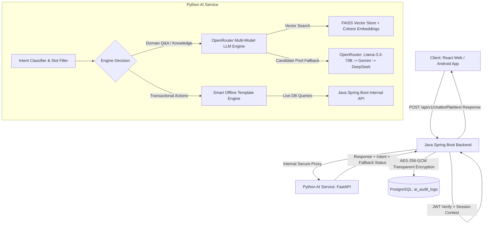

# 🤖 NovaTicket AI Assistant Service (Python RAG & Multi-Engine Agent)

Microservice trợ lý ảo thông minh cho hệ thống rạp chiếu phim **NovaTicket**, tích hợp chặt chẽ với Java Spring Boot backend và Frontend React / Mobile Android thông qua kiến trúc **RAG (Retrieval-Augmented Generation)** và **Multi-Engine Intent Routing**.

---

## 🏛️ Kiến Trúc Tổng Thể



---

## 🚀 Tính Năng Nổi Bật

1. **Multi-Model LLM Candidate Pool & Tự Động Phục Hồi (Resilient Fallback)**:
   - **Primary Model**: `meta-llama/llama-3.3-70b-instruct:free`
   - **Fallback Pool**: `google/gemini-2.0-flash-exp:free`, `deepseek/deepseek-chat`, `mistralai/mistral-7b-instruct:free`, `qwen/qwen-2.5-72b-instruct:free`
   - **Nhiệt độ**: `temperature=0.0` (Chuẩn Enterprise chống hallucination).
   - **Timeout per Model**: `8.0s` với cơ chế thử model dự phòng tiếp theo nếu gặp lỗi kết nối hoặc Rate Limit (429).
   - **Offline Fallback**: Tự động chuyển về `Smart Template Engine` nếu tất cả LLM đều bận/hết quota, đảm bảo trải nghiệm khách hàng không bao giờ bị gián đoạn.

2. **Đặt Vé Nhanh Qua Hội Thoại (Draft Booking Assistant)**:
   - Hỗ trợ chọn phim, chọn rạp, chọn suất chiếu, chọn ghế và giữ chỗ tạm thời (Draft Booking) ngay trong khung chat AI.

3. **Hệ Thống Đặt & Quản Lý Nhắc Lịch Xem Phim (Reminder Scheduler)**:
   - Nhắc lịch khi có suất chiếu mới hoặc nhắc trước giờ chiếu 1 tiếng qua Firebase Push Notification.
   - Hỗ trợ xem, tra cứu và hủy nhắc lịch qua lệnh chat tự nhiên.

4. **Tích Hợp Dự Báo Thời Tiết (Weather Intelligence)**:
   - Tự động kiểm tra điều kiện thời tiết tại khu vực rạp vào thời điểm suất chiếu diễn ra để cảnh báo người dùng mang theo áo mưa hoặc xuất phát sớm.

5. **Multi-turn Memory & Contextual Pagination**:
   - Duy trì ngữ cảnh phiên trò chuyện nhiều lượt (Multi-turn), cho phép hỏi tiếp *"2 phim nào nữa?"*, *"ở rạp đó có suất mấy giờ?"* mượt mà.

---

## 🛠️ Tech Stack

| Thành phần | Công nghệ | Mô tả |
| :--- | :--- | :--- |
| **Framework** | FastAPI + Uvicorn | Hiệu năng cao, async I/O non-blocking |
| **LLM Gateway** | OpenRouter API | Cung cấp pool LLM mã nguồn mở & thương mại đa dạng |
| **Embedding** | Cohere API (`embed-multilingual-v3.0`) | Hỗ trợ tiếng Việt xuất sắc, không cần GPU local |
| **Vector Database** | FAISS (`faiss-cpu`) | Tìm kiếm tương đồng vector siêu tốc trên bộ nhớ đệm |
| **Data Ingestion** | Python LangChain Chunkers | Tách văn bản policies/FAQs thông minh theo đoạn ngữ nghĩa |
| **Python Version** | Python 3.10+ | |

---

## 📂 Cấu Trúc Thư Mục

```
Backend/ai-booking/
├── app/
│   ├── main.py                # FastAPI app & REST endpoints (/api/v1/chat, /health)
│   ├── config.py              # Quản lý biến môi trường bằng Pydantic BaseSettings
│   ├── ingestion/             # Pipeline nạp dữ liệu Vector DB
│   │   ├── loader.py          # Đọc tài liệu .md/.txt/.json
│   │   ├── chunker.py         # Phân đoạn văn bản (chunk_size=400, overlap=50)
│   │   ├── embedder.py        # Wrapper gọi Cohere Embedding API
│   │   └── vector_store.py    # FAISS local vector store manager
│   └── agent/                 # Lõi xử lý thông minh của Chatbot
│       ├── agent_factory.py   # Factory khởi tạo và điều phối các engines
│       ├── chatbot.py         # Controller trung tâm, lưu giữ Session State
│       ├── engines/           # Các engine chuyên biệt
│       │   ├── llm_engine.py      # OpenRouter Multi-Model Loop & RAG Prompting
│       │   └── template_engine.py # Smart Offline Template Engine
│       └── tools.py           # Java Spring Boot API Connectors
├── scripts/
│   └── ingest.py              # Script nạp dữ liệu vào FAISS index độc lập
├── data/                      # Dữ liệu tri thức tĩnh (Knowledge Base)
│   ├── policies/              # Chính sách hoàn vé, điểm thưởng, hội viên
│   ├── faq/                   # Câu hỏi thường gặp
│   └── cinema_info/           # Thông tin hệ thống rạp và bảng giá
├── test_agent.py              # Bộ kiểm thử tự động toàn diện 12 Test Suites
├── requirements.txt           # Danh mục dependencies Python
├── .env                       # Biến môi trường local (Không commit lên Git)
└── .env.example               # Template biến môi trường chuẩn
```

---

## ⚡ Hướng Dẫn Cài Đặt & Chạy Môi Trường Local

### Bước 1: Tạo môi trường ảo (Virtualenv) & Cài thư viện

```bash
cd Backend/ai-booking

# Khởi tạo venv
python -m venv venv

# Kích hoạt venv
# Trên Windows (PowerShell/CMD):
.\venv\Scripts\activate
# Trên Linux/macOS:
source venv/bin/activate

# Cài đặt thư viện
pip install -r requirements.txt
```

---

### Bước 2: Thiết lập Biến Môi Trường (`.env`)

Tạo file `.env` từ file mẫu `.env.example`:

```bash
cp .env.example .env
```

Điền các thông số cần thiết:

```env
# Server
APP_HOST=0.0.0.0
APP_PORT=8000
APP_ENV=development

# Java Spring Boot Backend
JAVA_API_BASE=http://localhost:8080
INTERNAL_API_KEY=your_shared_internal_secret_key

# OpenRouter LLM Pool
OPENROUTER_API_KEY=sk-or-v1-your-openrouter-key
LLM_MODEL=meta-llama/llama-3.3-70b-instruct:free
LLM_FALLBACK_MODELS=google/gemini-2.0-flash-exp:free,deepseek/deepseek-chat,mistralai/mistral-7b-instruct:free,qwen/qwen-2.5-72b-instruct:free
LLM_TEMPERATURE=0.0
LLM_TIMEOUT=8.0
LLM_MAX_TOKENS=1024
USE_MOCK_AI=false

# Vector DB & Cohere Embeddings
COHERE_API_KEY=your-cohere-api-key
EMBEDDING_MODEL=embed-multilingual-v3.0
VECTOR_DB_DIR=./faiss_index
CHROMA_COLLECTION=nova_knowledge

# Security & CORS
JWT_SECRET=your_jwt_secret_matching_java_backend
CORS_ORIGINS=http://localhost:8080,http://localhost:5173
```

---

### Bước 3: Nạp Dữ Liệu Vào Vector Store (FAISS Ingestion)

Chạy script sau mỗi lần cập nhật file chính sách hoặc FAQ trong thư mục `data/`:

```bash
python scripts/ingest.py
```

*Output mẫu:*
```
=======================================================
  NovaTicket RAG — Data Ingestion
=======================================================
📂 Đọc file từ: data
   ✓ Đọc được 10 tài liệu
✂️  Chunking (size=400, overlap=50) -> Tạo được 12 chunks
🔢 Embedding với Cohere API: embed-multilingual-v3.0
💾 Lưu vào FAISS index tại: ./faiss_index
✅ Hoàn thành!
```

---

### Bước 4: Chạy Server AI

```bash
uvicorn app.main:app --reload --port 8000
```

* Truy cập Swagger UI kiểm thử: `http://localhost:8000/docs`
* Endpoint Health Check: `GET http://localhost:8000/health`

---

## 🧪 Chạy Bộ Kiểm Thử Tự Động (Test Suite)

Chạy toàn bộ 12 kịch bản kiểm thử tích hợp (Bao gồm Multi-turn Memory, Weather, Reminder, Draft Booking, OpenRouter candidate fallback, Rate-limit 429 & 500 error resilience):

```bash
python test_agent.py
```

*Kết quả chuẩn:*
```
=== COMPLETE TESTING AI AGENT SUCCESSFULLY ===
```
