# 🎬 NovaTicket Web Frontend (React + Vite)

Giao diện Web đa cổng thông tin (Multi-Portal Web Application) cho hệ sinh thái đặt vé xem phim **NovaTicket**, được xây dựng trên nền tảng **React 18**, **Vite**, **Tailwind CSS** và **Zustand / TanStack React Query**.

---

## 🏛️ Cấu Trúc 3 Cổng Thông Tin (Multi-Portal Architecture)

```mermaid
graph TD
    Root[NovaTicket Web App] --> Customer[1. Customer Portal: /]
    Root --> Staff[2. Staff Portal: /staff/*]
    Root --> Admin[3. Admin Portal: /admin/*]

    subgraph Customer Portal
        Customer --> C_Home[Trang chủ & Phim đang chiếu]
        Customer --> C_Booking[Đặt vé, Chọn ghế, Chọn combo, Thanh toán VNPay]
        Customer --> C_Tickets[Ví vé điện tử QR & Lịch sử giao dịch]
        Customer --> C_AI[Trợ lý AI Chatbot Nova với Session Persistence]
    end

    subgraph Staff Portal
        Staff --> S_POS[Quầy bán vé tại rạp POS]
        Staff --> S_Checkin[Soát vé Check-in bằng QR Scanner]
        Staff --> S_Audit[Tra cứu lịch sử Chat AI CSKH 2 bước]
    end

    subgraph Admin Portal
        Admin --> A_Dash[Dashboard doanh thu & Biểu đồ phân tích]
        Admin --> A_Cinema[Quản lý Rạp & Sơ đồ ghế động Seat Builder]
        Admin --> A_Showtime[Xếp lịch chiếu Gantt Timeline & Giá động]
        Admin --> A_Campaign[Chiến dịch Push Notification FCM]
        Admin --> A_Audit[Kiểm toán & Tra cứu hội thoại AI bảo mật]
    end
```



---

## 🚀 Tính Năng Chính

### 1. 🎟️ Cổng Khách Hàng (Customer Portal)
* **Trang chủ & Khám phá phim**: Banner phim nổi bật, bộ lọc phim đang chiếu / sắp chiếu, trailer modal, xem đánh giá và review.
* **Quy trình Đặt Vé Real-time 5 Bước**:
  1. *Chọn Suất chiếu*: Lọc theo rạp, định dạng 2D/3D/IMAX, ngày chiếu.
  2. *Sơ đồ Ghế (Seat Picker)*: Giao diện trực quan phân loại ghế Thường, VIP, Đôi (Sweetbox) với trạng thái giữ chỗ tạm thời và đồng hồ đếm ngược 10 phút.
  3. *Chọn Combo & Bắp Nước*: Tự động tính tổng tiền.
  4. *Áp dụng Khuyến Mãi*: Nhập Voucher hoặc đổi Điểm thưởng thành viên.
  5. *Thanh toán Đa kênh*: Cổng VNPay (QR / Thẻ ATM / Visa) hoặc Ví NovaTicket.
* **Ví Vé Điện Tử (E-Ticket & QR Code)**: Hiển thị mã QR động để check-in tại quầy hoặc cửa rạp, hỗ trợ hủy vé hoàn điểm tự động theo chính sách.
* **Trợ Lý Ảo AI Chatbot**:
  - Giao diện chat nổi thông minh với hiệu ứng animation mượt mà.
  - Tự động lưu trữ ngữ cảnh hội thoại vào `sessionStorage` (chống mất dữ liệu khi F5).
  - Tích hợp các gợi ý câu hỏi nhanh (Lịch chiếu, Khuyến mãi, Rạp gần nhất).

### 2. 👩‍💼 Cổng Nhân Viên Rạp (Staff Portal)
* **Quầy Bán Vé Tại Rạp (POS Page)**: Thao tác nhanh cho nhân viên bán vé trực tiếp cho khách tại quầy.
* **Soát Vé Check-in QR**: Quét mã QR vé bằng camera hoặc nhập mã code thủ công, tự động kiểm tra tính hợp lệ và cập nhật trạng thái đã vào rạp.
* **Tra Cứu AI CSKH**: Tiếp nhận khiếu nại khách hàng, tìm kiếm danh tính và xem lịch sử tương tác AI trong 30 ngày.

### 3. 🛡️ Cổng Quản Trị Hệ Thống (Admin Portal)
* **Dashboard Phân Tích**: Biểu đồ doanh thu Area Chart, tỷ lệ lấp đầy rạp, top phim ăn khách, doanh thu theo từng cụm rạp.
* **Seat Layout Builder**: Công cụ kéo thả tạo và tùy chỉnh sơ đồ ghế phòng chiếu linh hoạt.
* **Gantt Showtime Timeline**: Giao diện trực quan quản lý suất chiếu chống trùng giờ và tối ưu hóa thời gian dọn phòng.
* **Dynamic Pricing Engine**: Cấu hình giá vé linh hoạt theo khung giờ vàng, ngày cuối tuần, ngày lễ.
* **Push Notification Campaign Manager**: Soạn thảo và phát chiến dịch thông báo toàn hệ thống hoặc theo phân khúc khách VIP qua Firebase FCM.
* **Kiểm Toán Nhật Ký Hội Thoại AI (AI Audit Log System)**:
  - Quy trình bảo mật 2 bước: Tìm kiếm khách hàng theo Tên/Email/SĐT ➔ Xác nhận lý do kiểm toán (Audit the Auditor) ➔ Giải mã AES-256-GCM trong suốt.

---

## 🛠️ Tech Stack & Thư Viện

| Thành phần | Thư viện / Công nghệ |
| :--- | :--- |
| **Core Framework** | React 18 + Vite (SPA) |
| **Styling** | Tailwind CSS + Radix UI Primitives |
| **State Management** | Zustand (Global Auth, Booking, Local State) |
| **Server State & Caching** | TanStack React Query v5 |
| **Routing** | React Router DOM v6 (Lazy Loading & Protected Route Guards) |
| **Form & Validation** | React Hook Form + Zod Schema Validation |
| **Icons & Animation** | Lucide React + Framer Motion |
| **Charts** | Recharts |
| **HTTP Client** | Axios (JWT Interceptor, Auto Refresh Token) |
| **Notification Toast** | React Hot Toast |

---

## 📂 Cấu Trúc Thư Mục Frontend

```
Frontend/nova-ticketbooking/
├── src/
│   ├── api/                   # Cấu hình Axios client & API endpoints
│   │   ├── client.js          # Axios instance với Interceptors tự động refresh token
│   │   └── endpoints.js       # Toàn bộ danh mục gọi API backend
│   ├── components/            # UI Components tái sử dụng
│   │   ├── common/            # Buttons, FormElements, Modals, AdminTable, PageLoader
│   │   └── customer/          # AiChatbot, MovieCard, BookingTimer, ReviewList
│   ├── layouts/               # Layout cha cho từng cổng
│   │   ├── CustomerLayout.jsx # Layout khách hàng (Header, Footer, Floating Chatbot)
│   │   ├── StaffLayout.jsx    # Layout nhân viên rạp
│   │   ├── AdminLayout.jsx    # Layout quản trị viên (Sidebar collapsible, Header)
│   │   └── AuthLayout.jsx     # Layout đăng nhập / đăng ký
│   ├── pages/                 # Các màn hình theo từng phân hệ
│   │   ├── customer/          # Home, Movies, Booking Flow, Tickets, Profile, GiftCards
│   │   ├── staff/             # POS, CheckIn, Dashboard
│   │   └── admin/             # Dashboard, Movies, Cinemas, Showtimes, Combos, AI Audit
│   ├── router/                # Cấu hình định tuyến React Router
│   ├── stores/                # Zustand stores (authStore, bookingStore)
│   ├── hooks/                 # Custom React Hooks
│   └── utils/                 # Formatters (tiền tệ VND, ngày giờ, classnames)
├── public/                    # Assets tĩnh
├── index.html                 # Single Page Application HTML entry
├── vite.config.js             # Cấu hình Vite & Alias `@/`
└── package.json
```

---

## ⚡ Hướng Dẫn Cài Đặt & Chạy Môi Trường Local

### Bước 1: Cài đặt Dependencies

```bash
cd Frontend/nova-ticketbooking

# Cài đặt node_modules
npm install
```

---

### Bước 2: Khởi động Development Server

```bash
npm run dev
```

* Ứng dụng sẽ chạy tại: `http://localhost:5173`
* Tự động Proxy API request tới Backend Spring Boot tại `http://localhost:8080`.

---

### Bước 3: Build Production Bundle

```bash
npm run build
```

* File sau khi tối ưu và nén minified sẽ nằm trong thư mục `dist/`.
* Xem thử bản build production trên local:
  ```bash
  npm run preview
  ```
