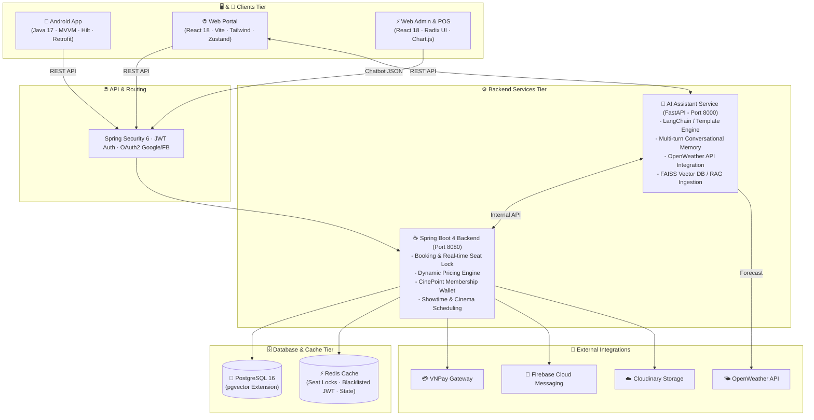
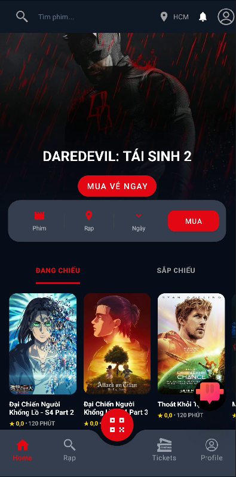
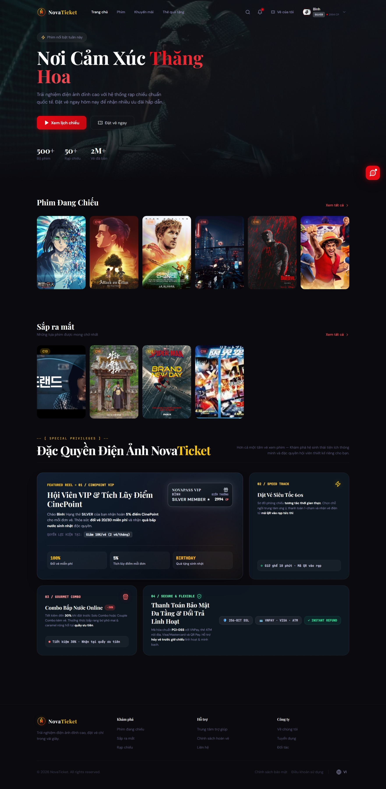

<div align="center">

  

  # 🎬 NovaTicket — Next-Gen Cinema Booking Platform

  <p align="center">
    <b>Hệ sinh thái Đặt vé & Quản lý Rạp chiếu phim Toàn diện với kiến trúc Monorepo Đa Dịch Vụ</b><br/>
    <i>(Android Native App · React Web Customer & Admin/POS · Spring Boot Backend · FastAPI AI Assistant)</i>
  </p>

  <p align="center">
    <a href="./README.md"><b>🇻🇳 Tiếng Việt</b></a> • 
    <a href="./README_EN.md">🇬🇧 English</a>
  </p>

  <p align="center">
    
    
    
    
    
    
    
    
    
  </p>

</div>

---

## 📑 Mục Lục (Table of Contents)

1. [🌟 Giới Thiệu Tổng Quan](#-giới-thiệu-tổng-quan)
2. [🏗️ Kiến Trúc Hệ Thống (System Architecture)](#️-kiến-trúc-hệ-thống-system-architecture)
3. [💻 Công Nghệ Sử Dụng (Tech Stack)](#-công-nghệ-sử-dụng-tech-stack)
4. [✨ Tính Năng Nổi Bật (Key Features)](#-tính-năng-nổi-bật-key-features)
   - [📱 1. Mobile Android App (Khách Hàng)](#1--mobile-android-app-khách-hàng)
   - [🌐 2. Web Portal (Khách Hàng & Bento Grid)](#2--web-portal-khách-hàng--bento-grid)
   - [⚡ 3. Web POS & Admin CMS (Quản Trị & Bán Vé)](#3--web-pos--admin-cms-quản-trị--bán-vé)
   - [🤖 4. Nova AI Assistant (Trợ Lý Ảo Đa Lượt & Dự Báo Thời Tiết)](#4--nova-ai-assistant-trợ-lý-ảo-đa-lượt--dự-báo-thời-tiết)
   - [⚙️ 5. Spring Boot Core Backend](#5-️-spring-boot-core-backend)
5. [📸 Giao Diện Trải Nghiệm (Showcase)](#-giao-diện-trải-nghiệm-showcase)
6. [📂 Cấu Trúc Dự Án (Monorepo Directory)](#-cấu-trúc-dự-án-monorepo-directory)
7. [🚀 Hướng Dẫn Cài Đặt & Khởi Chạy (Getting Started)](#-hướng-dẫn-cài-đặt--khởi-chạy-getting-started)
8. [🛡️ Bảo Mật & Quy Chuẩn Phát Triển](#️-bảo-mật--quy-chuẩn-phát-triển)

---

## 🌟 Giới Thiệu Tổng Quan

**NovaTicket** là nền tảng điện ảnh đa nền tảng thế hệ mới, được thiết kế theo kiến trúc **Monorepo** phục vụ trọn vẹn toàn bộ chu trình hoạt động của cụm rạp:

- **Khách hàng**: Trải nghiệm đặt vé siêu tốc 60s trên **Web** & **Mobile App (Android)**, thanh toán an toàn qua VNPay / Thẻ ATM / Visa, tích điểm thăng hạng hội viên **CinePoint (Bronze ➔ Silver ➔ Gold ➔ Diamond)**, mua trước bắp nước ưu đãi và nhận hỗ trợ 24/7 từ trợ lý thông minh **Nova AI Assistant**.
- **Nhân viên tại quầy**: Sử dụng hệ thống **Web POS** chuyên nghiệp để chọn ghế, bán vé, in vé QR, bán combo bắp nước và quét mã check-in tức thì.
- **Quản trị viên (Admin)**: Toàn quyền cấu hình cụm rạp, sơ đồ phòng chiếu, lập lịch suất chiếu, điều chỉnh bảng giá động (**Dynamic Pricing Rules**) và theo dõi biểu đồ doanh thu thời gian thực.

---

## 🏗️ Kiến Trúc Hệ Thống (System Architecture)



---

## 💻 Công Nghệ Sử Dụng (Tech Stack)

| Thành Phần | Công Nghệ / Framework | Chi Tiết Sử Dụng |
| :--- | :--- | :--- |
| **☕ Backend Core** | Java 21 LTS, Spring Boot 4.0.3+ | Spring Data JPA, Hibernate, Spring Security (JWT 0.12.5), MapStruct, Lombok, Maven |
| **🤖 AI Assistant** | Python 3.10+, FastAPI, Uvicorn | LangChain, FAISS VectorDB, Cohere Embeddings (`embed-multilingual-v3.0`), Google Gemini (`gemini-2.5-flash`), OpenWeather API |
| **🌐 Web Frontend** | React 18, Vite 5.4, Tailwind CSS 3.4 | Zustand (State Management), TanStack React Query v5, Radix UI, Framer Motion, Lucide Icons |
| **📱 Mobile App** | Java 17, Android Native | MVVM Architecture, Android Jetpack (Hilt DI, ViewBinding, Room, LiveData), Retrofit 2 |
| **🗄️ CSDL & Cache** | PostgreSQL 16 (`pgvector`), Redis | Lưu trữ quan hệ, Vector Embedding cho tìm kiếm ngữ nghĩa, Caching suất chiếu & Giữ ghế Real-time |
| **🔌 Dịch Vụ Ngoài** | VNPay, Firebase FCM, Cloudinary | Thanh toán trực tuyến VNPay Sandbox/Prod, Thông báo đẩy FCM, Lưu trữ media phim/rạp |

---

## ✨ Tính Năng Nổi Bật (Key Features)

### 1. 📱 Mobile Android App (Khách Hàng)
* **Giao diện Cinema Dark Theme**: Tông màu điện ảnh `#0D1B2A` & Accent Gold `#F5C518`, tối ưu hóa trải nghiệm vuốt chạm.
* **Quy trình Đặt Vé Hoàn Chỉnh**: Chọn suất chiếu ➔ Chọn ghế tương tác ➔ Chọn Combo Bắp Nước ➔ Thanh toán VNPay / Thẻ quà tặng.
* **E-Ticket & Check-in QR**: Vé điện tử lưu trực tiếp trên app với mã QR thời gian thực, quét mã vào rạp tức thì.
* **Đánh giá phim (Verified Purchase)**: Chỉ người dùng đã thực sự mua vé và xem phim mới được quyền viết đánh giá & chấm sao.
* **Thông báo cá nhân hóa (FCM)**: Tự động gửi push notification khi có lịch chiếu mới hoặc trước giờ chiếu 1 tiếng.

### 2. 🌐 Web Portal (Khách Hàng & Bento Grid)
* **Hero Showcase & AutoPlay Carousel**: Trình diễn trailer phim bom tấn và banner khuyến mãi mượt mà.
* **Bento Grid Điện Ảnh Bất Đối Xứng (2-1 / 1-2)**: Khối giới thiệu đặc quyền đẳng cấp, phá vỡ sự đối xứng đơn điệu.
* **Thẻ Hội Viên VIP Động (Dynamic Tier Card)**: Tự động chuyển đổi màu sắc, hào quang (Glow) và tỷ lệ hoàn điểm theo rank của tài khoản:
  * 💎 **DIAMOND**: Ánh kim Cyan Titan, hoàn 10% CP, giảm 30.000đ/vé.
  * 🥇 **GOLD**: Hoàng kim Gold VIP, hoàn 7% CP, giảm 20.000đ/vé.
  * 🥈 **SILVER**: Bạc Silver sang trọng, hoàn 5% CP, giảm 10.000đ/vé.
  * 🥉 **BRONZE**: Đồng cổ điển, hoàn 3% CP, tích điểm đổi vé 2D/3D miễn phí.
* **Smart Role Redirection**: Tự động chuyển hướng tài khoản `ADMIN` về `/admin/dashboard` và `STAFF` về `/staff/dashboard` khi truy cập trang khách hàng.

### 3. ⚡ Web POS & Admin CMS (Quản Trị & Bán Vé)
* **Hệ Thống Bán Vé Nhanh (POS)**: Dành riêng cho thu ngân tại rạp, thao tác 1 chạm bán vé + combo bắp nước kèm in hóa đơn.
* **Cấu Hình Giá Động (Dynamic Pricing Rules Engine)**: Thiết lập phụ thu theo Khung Giờ Vàng (Peak Hours), Ngày Cuối Tuần (Weekend), Ngày Lễ (Holiday) hoặc loại ghế đặc biệt (VIP/Sweetbox).
* **Quản Lý Cụm Rạp & Phòng Chiếu**: Thiết lập bản đồ ghế trực quan (Ma trận hàng/cột, loại ghế, lối đi).
* **Báo Cáo & Thống Kê**: Biểu đồ doanh thu vé, doanh thu F&B và tỷ lệ lấp đầy phòng chiếu theo thời gian thực.

### 4. 🤖 Nova AI Assistant (Trợ Lý Ảo Đa Lượt & Dự Báo Thời Tiết)
* **Trí Nhớ Hội Thoại Đa Lượt (Multi-turn Conversational Memory)**: Lưu vết danh mục phim và rạp, hỗ trợ phân trang nối tiếp thông minh (*"Hiện tại rạp tại Hà Nội có chiếu phim nào?"* ➔ *"2 phim nào nữa?"* ➔ *"Còn phim nào khác không?"*).
* **Tích Hợp Dự Báo Thời Tiết (Weather Integration)**: Tự động gọi OpenWeather API cung cấp dự báo thời tiết tại vị trí cụ thể của rạp (*"thời tiết ở rạp Quận 12 hôm nay thế nào?"*, cảnh báo mưa giông trước giờ chiếu).
* **Tra Cứu Suất Chiếu & Tạo Đặt Vé Nháp**: Tìm kiếm suất chiếu theo tên phim/rạp/ngày và tạo Draft Booking UUID tức thì.
* **Quản Lý Nhắc Lịch Thông Minh (Reminders)**: Hẹn giờ nhắc khi phim mở bán vé hoặc nhắc trước giờ chiếu 60 phút.

### 5. ⚙️ Spring Boot Core Backend
* **Real-time Seat Locking**: Cơ chế giữ ghế tối đa 10 phút sử dụng Redis TTL, ngăn chặn tình trạng đặt trùng ghế (Double-booking).
* **Bảo Mật Đa Tầng**: JWT Access/Refresh Token, mã hóa mật khẩu BCrypt, Blacklist Token khi đăng xuất.
* **Tích Hợp Thanh Toán VNPay**: Xử lý IPN callback, xác thực chữ ký bảo mật SHA512, tự động hoàn tiền vé khi hủy theo quy định.

---

## 📸 Giao Diện Trải Nghiệm (Showcase)

<div align="center">
  <table border="0">
    <tr>
      <td align="center" width="30%">
        <b>📱 Mobile App (Android)</b><br/><br/>
        
      </td>
      <td align="center" width="70%">
        <b>🌐 Web Customer Portal & Bento Grid</b><br/><br/>
        
      </td>
    </tr>
  </table>
</div>

---

## 📂 Cấu Trúc Dự Án (Monorepo Directory)

```text
Project_Android-TicketBooking/
├── .agents/                        # Bộ quy chuẩn AI Agent & Skills
│   ├── skills/
│   │   ├── plan-first/             # Quy trình bắt buộc lập kế hoạch & User Confirm
│   │   ├── ui-ux-pro-max/          # Design System Intelligence & Tone điện ảnh
│   │   ├── api-design/             # Tiêu chuẩn thiết kế REST API & DTO
│   │   ├── db-migration/           # Quy chuẩn PostgreSQL & Flyway
│   │   └── security/               # Chuẩn xác thực JWT & Phân quyền
│   └── workflows/                  # Workflows: Debug, Test, Viết API, Tạo PR
│
├── App/                            # 📱 Ứng dụng Mobile Android (Java 17, MVVM, Hilt)
│
├── Backend/
│   ├── ticket-booking/             # ☕ Core API Spring Boot 4 (Java 21 LTS)
│   │   ├── src/main/java/com/cinema/ticket_booking/
│   │   │   ├── controller/         # REST Controllers (Auth, Movie, Booking, POS, AI)
│   │   │   ├── service/            # Business Logic & Pricing Engine
│   │   │   ├── repository/         # Spring Data JPA Repositories
│   │   │   ├── model/              # Database Entities (PostgreSQL)
│   │   │   ├── dto/                # Request & Response DTOs
│   │   │   └── security/           # JWT Filters & Security Config
│   │   └── pom.xml
│   │
│   └── ai-booking/                 # 🤖 AI Assistant Service (FastAPI, Python 3.10+)
│       ├── app/
│       │   ├── agent/              # Multi-turn Engine, State & Intent Classifier
│       │   ├── tools/              # Weather Tools, Showtime Tools, Reminder Tools
│       │   └── vectorstore/        # FAISS Index & Cohere Embeddings
│       ├── test_agent.py           # Unit Test Suite (11 Test Suites - 100% Pass)
│       └── requirements.txt
│
├── Frontend/
│   └── nova-ticketbooking/         # 🌐 Web Customer & Admin CMS / POS (React 18 + Vite)
│       ├── src/
│       │   ├── components/         # Bento Grid, AiChatbot, SeatPicker, Navbar, POS
│       │   ├── pages/              # Customer, Admin, Staff, Auth Pages
│       │   ├── layouts/            # CustomerLayout, AdminLayout, StaffLayout
│       │   ├── stores/             # Zustand Auth & Booking Stores
│       │   └── router/             # Smart Role-based Route Guards
│       ├── tailwind.config.js
│       └── package.json
│
├── Database/                       # 🗄️ Database Scripts & Migration SQL
├── design-system/                  # 🎨 Design System Tokens (MASTER.md)
├── AGENTS.md                       # Quy ước Đặt tên, Công nghệ & Phân tầng kiến trúc
├── GEMINI.md                       # Cấu hình IDE Antigravity & Command Permissions
└── README.md                       # Tài liệu tổng quan dự án
```

---

## 🚀 Hướng Dẫn Cài Đặt & Khởi Chạy (Getting Started)

### 📋 Yêu Cầu Môi Trường (Prerequisites)
* **Java Development Kit (JDK)**: `21 LTS` (Backend) và `17+` (Android).
* **Node.js**: `v18.x` hoặc `v20.x` & `npm`.
* **Python**: `3.10+` và `pip`.
* **PostgreSQL**: `16+` (Kích hoạt extension `pgvector`).
* **Redis**: Cổng `6379`.
* **Android Studio**: Ladybug / Hedgehog trở lên.

---

### 1️⃣ Khởi Chạy Backend (Spring Boot Core API)

```bash
cd Backend/ticket-booking

# Cấu hình biến môi trường trong src/main/resources/application.yml (hoặc .env)
# Khởi chạy ứng dụng:
mvn clean spring-boot:run
```
> 📍 **Backend REST API:** `http://localhost:8080`  
> 📖 **Swagger / OpenAPI:** `http://localhost:8080/swagger-ui.html`

---

### 2️⃣ Khởi Chạy AI Assistant Service (FastAPI)

```bash
cd Backend/ai-booking

# Tạo môi trường ảo & cài đặt thư viện:
python -m venv venv
venv\Scripts\activate          # Windows (macOS/Linux: source venv/bin/activate)
pip install -r requirements.txt

# Nạp dữ liệu vào FAISS Index (chạy lần đầu):
python scripts/ingest.py

# Khởi động server FastAPI:
uvicorn app.main:app --reload --port 8000
```
> 📍 **AI Service API:** `http://localhost:8000`  
> 🧪 **Chạy toàn bộ 11 bài kiểm thử AI:** `python test_agent.py`

---

### 3️⃣ Khởi Chạy Web Frontend (Customer & Admin/POS)

```bash
cd Frontend/nova-ticketbooking

# Cài đặt dependencies:
npm install

# Khởi chạy Web Server:
npm run dev
```
> 📍 **Web Customer Portal & Admin CMS:** `http://localhost:5173`

---

### 4️⃣ Khởi Chạy Mobile App (Android Native)

1. Mở thư mục `App/` bằng **Android Studio**.
2. Đợi quá trình Gradle Sync hoàn tất.
3. Cấu hình địa chỉ IP máy chủ trong file `local.properties` (ví dụ: `BASE_URL=http://10.0.2.2:8080/api/` nếu dùng Emulator).
4. Nhấn **Run** (`Shift + F10`) trên máy ảo hoặc thiết bị Android thật.

---

## 🛡️ Bảo Mật & Quy Chuẩn Phát Triển

- 🔒 **Bảo vệ tài nguyên nhạy cảm**: Không bao giờ commit các file bí mật (`.env`, `google-services.json`, `service-account.json`, khóa VNPay) lên Git.
- 📐 **Quy chuẩn lập trình**:
  - Tuân thủ nghiêm ngặt quy tắc phân tầng trong [`AGENTS.md`](./AGENTS.md).
  - Tuân thủ quy chuẩn thiết kế UI/UX điện ảnh trong [`design-system/novaticket/MASTER.md`](./design-system/novaticket/MASTER.md).
---

<div align="center">
  <sub>⭐️ Nếu bạn thấy dự án <b>NovaTicket</b> hữu ích, hãy ủng hộ team bằng 1 Star trên GitHub nhé! ⭐️</sub><br/>
  <sub>Crafted with passion by <b>Nova Ticket Team</b> ❤️</sub>
</div>
