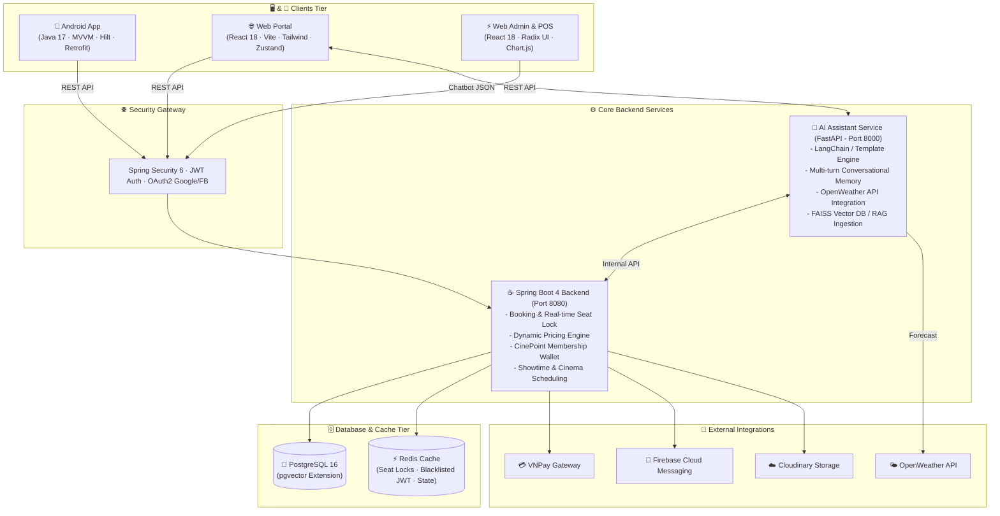

<div align="center">

  

  # 🎬 NovaTicket — Next-Gen Cinema Booking Platform

  <p align="center">
    <b>A Comprehensive Multi-Service Monorepo Platform for Smart Cinema Operations & Online Ticket Booking</b><br/>
    <i>(Android Native App · React Web Customer & Admin/POS · Spring Boot Backend · FastAPI AI Assistant)</i>
  </p>

  <p align="center">
    <a href="./README.md">🇻🇳 Tiếng Việt</a> • 
    <a href="./README_EN.md"><b>🇬🇧 English</b></a>
  </p>

  <p align="center">
    
    
    
    
    
    
    
    
    
  </p>

</div>

---

## 📑 Table of Contents

1. [🌟 Overview](#-overview)
2. [🏗️ System Architecture](#️-system-architecture)
3. [💻 Tech Stack](#-tech-stack)
4. [✨ Key Features](#-key-features)
   - [📱 1. Mobile Android App (Customer Facing)](#1--mobile-android-app-customer-facing)
   - [🌐 2. Web Customer Portal (Cinema Bento Grid)](#2--web-customer-portal-cinema-bento-grid)
   - [⚡ 3. Web POS & Admin CMS (Cashier & Management)](#3--web-pos--admin-cms-cashier--management)
   - [🤖 4. Nova AI Assistant (Multi-turn Memory & Weather Forecast)](#4--nova-ai-assistant-multi-turn-memory--weather-forecast)
   - [⚙️ 5. Spring Boot Core Backend](#5-️-spring-boot-core-backend)
5. [📸 Visual Showcase](#-visual-showcase)
6. [📂 Monorepo Project Structure](#-monorepo-project-structure)
7. [🚀 Getting Started & Installation](#-getting-started--installation)
8. [🛡️ Security & Engineering Standards](#️-security--engineering-standards)

---

## 🌟 Overview

**NovaTicket** is an end-to-end, enterprise-grade cinema platform built upon a modern **Monorepo** architecture designed to streamline all facets of cinema management and ticketing:

- **End Users / Moviegoers**: Lightning-fast 60s ticket booking on **Web** & **Android Mobile App**, seamless checkout via VNPay / ATM cards / Visa, dynamic **CinePoint Loyalty Tiering (Bronze ➔ Silver ➔ Gold ➔ Diamond)**, discounted popcorn/drink pre-orders, and 24/7 smart customer support via **Nova AI Assistant**.
- **On-site Cashiers & Staff**: High-velocity **Web POS** interface to handle seat mapping, instant ticketing, digital QR receipts, concession sales, and one-tap customer check-ins.
- **Cinema Managers & Administrators**: Full suite CMS to manage cinema chains, hall layouts, showtime scheduling, **Dynamic Pricing Rules Engine** (peak hours, holidays, seat classes), and real-time revenue analytics.

---

## 🏗️ System Architecture



---

## 💻 Tech Stack

| Module | Technologies / Frameworks | Purpose & Implementation |
| :--- | :--- | :--- |
| **☕ Backend Core** | Java 21 LTS, Spring Boot 4.0.3+ | Spring Data JPA, Hibernate, Spring Security (JWT 0.12.5), MapStruct, Lombok, Maven |
| **🤖 AI Assistant** | Python 3.10+, FastAPI, Uvicorn | LangChain, FAISS Vector DB, Cohere Multilingual Embeddings, Google Gemini (`gemini-2.5-flash`), OpenWeather API |
| **🌐 Web Frontend** | React 18, Vite 5.4, Tailwind CSS 3.4 | Zustand (State Management), TanStack React Query v5, Radix UI, Framer Motion, Lucide Icons |
| **📱 Mobile App** | Java 17, Android Native | MVVM Architecture, Android Jetpack (Hilt DI, ViewBinding, Room, LiveData), Retrofit 2 |
| **🗄️ Database & Cache** | PostgreSQL 16 (`pgvector`), Redis 7 | Relational persistence, Vector embeddings for semantic search, Showtime caching & Real-time Seat Locking |
| **🔌 External Services** | VNPay, Firebase FCM, Cloudinary | Online payment processing, FCM Push notifications, Cloud-based movie/banner assets |

---

## ✨ Key Features

### 1. 📱 Mobile Android App (Customer Facing)
* **Cinema Dark Aesthetic**: High-contrast theme featuring `#0D1B2A` deep navy and `#F5C518` gold accents.
* **Full-Cycle Booking Flow**: Showtime discovery ➔ Interactive seat map ➔ Concession combos ➔ VNPay / CinePoint wallet checkout.
* **E-Ticket & QR Check-in**: In-app digital tickets with dynamic QR codes for fast turnstile check-in.
* **Verified Purchase Reviews**: Only users with verified completed bookings can post ratings and reviews.
* **Automated Push Notifications**: FCM-powered alerts for newly released showtimes and pre-show countdowns.

### 2. 🌐 Web Customer Portal (Cinema Bento Grid)
* **Hero Showcase & AutoPlay Carousel**: High-impact trailer spotlights and promotional banners.
* **Handcrafted Asymmetrical Cinema Bento Grid (2-1 / 1-2)**: Modern bento layout showcasing platform perks.
* **Dynamic VIP Loyalty Card (Dynamic Tier Binding)**: Real-time visual adaptation based on user rank:
  * 💎 **DIAMOND**: Metallic Cyan Titan glow, 10% CinePoint cashback, 30K VND discount/ticket.
  * 🥇 **GOLD**: Royal Gold aura, 7% CinePoint cashback, 20K VND discount/ticket.
  * 🥈 **SILVER**: Sleek Silver aura, 5% CinePoint cashback, 10K VND discount/ticket.
  * 🥉 **BRONZE**: Classic Bronze styling, 3% CinePoint cashback, free 2D/3D ticket redemption.
* **Smart Role Redirection**: Automatically redirects logged-in `ADMIN` accounts to `/admin/dashboard` and `STAFF` to `/staff/dashboard` when navigating customer routes.

### 3. ⚡ Web POS & Admin CMS (Cashier & Management)
* **High-Speed POS (Point-of-Sale)**: Streamlined 1-tap checkout for tickets and concessions with receipt generation.
* **Dynamic Pricing Rules Engine**: Configure real-time price modifiers for Peak Hours (Gold Time), Weekends, Holidays, and Seat Types (VIP/Sweetbox).
* **Hall & Seat Map Designer**: Flexible cinema hall matrix editor with custom seat classes and aisle configuration.
* **Analytics & Business Intelligence**: Real-time sales charts, concession revenue breakdown, and occupancy heatmaps.

### 4. 🤖 Nova AI Assistant (Multi-turn Memory & Weather Forecast)
* **Multi-Turn Conversational Memory & Pagination**: Maintains session state for movie catalogs and cinema locations (*"What movies are currently playing in Hanoi?"* ➔ *"What are the other 2 movies?"* ➔ *"Any more movies?"*).
* **Cinema & Showtime Weather Integration**: Real-time OpenWeather forecasting for specific cinema locations and bad weather alerts before showtimes.
* **Showtime Discovery & Draft Bookings**: Instant showtime querying by title/location/date with UUID draft booking creation.
* **Smart Reminder Scheduling**: Set push reminders for ticket availability or 1 hour prior to showtime.

### 5. ⚙️ Spring Boot Core Backend
* **Real-time Seat Locking**: Redis-backed 10-minute temporary seat holds with automatic TTL expiration to prevent double-booking.
* **Multi-layer Security**: JWT Access/Refresh tokens, BCrypt hashing, and Redis token blacklisting upon logout.
* **VNPay Payment Gateway**: Secure SHA512 signature validation, instant IPN callback handling, and automated refund processing.

---

## 📸 Visual Showcase

<div align="center">
  <table border="0">
    <tr>
      <td align="center" width="30%">
        <b>📱 Mobile App (Android)</b><br/><br/>
        
      </td>
      <td align="center" width="70%">
        <b>🌐 Web Customer Portal & Bento Grid</b><br/><br/>
        
      </td>
    </tr>
  </table>
</div>

---

## 📂 Monorepo Project Structure

```text
Project_Android-TicketBooking/
├── .agents/                        # AI Agent Skillsets & Architectural Guidelines
│   ├── skills/
│   │   ├── plan-first/             # Mandatory Planning & User Confirmation Skill
│   │   ├── ui-ux-pro-max/          # Cinema Dark Design System Intelligence
│   │   ├── api-design/             # RESTful API & DTO Mapping Standards
│   │   ├── db-migration/           # PostgreSQL & Flyway Standards
│   │   └── security/               # JWT Authentication & RBAC Rules
│   └── workflows/                  # Standard Workflows: Debug, Test, API, PR
│
├── App/                            # 📱 Android Native App (Java 17, MVVM, Hilt)
│
├── Backend/
│   ├── ticket-booking/             # ☕ Core API Spring Boot 4 (Java 21 LTS)
│   │   ├── src/main/java/com/cinema/ticket_booking/
│   │   │   ├── controller/         # REST Controllers (Auth, Movie, Booking, POS, AI)
│   │   │   ├── service/            # Business Services & Pricing Engine
│   │   │   ├── repository/         # Spring Data JPA Data Layer
│   │   │   ├── model/              # Database Entities (PostgreSQL)
│   │   │   ├── dto/                # Request & Response DTOs
│   │   │   └── security/           # JWT Security Filters & Config
│   │   └── pom.xml
│   │
│   └── ai-booking/                 # 🤖 AI Assistant Service (FastAPI, Python 3.10+)
│       ├── app/
│       │   ├── agent/              # Multi-turn Engine, State & Intent Classifier
│       │   ├── tools/              # Weather Tools, Showtime Tools, Reminder Tools
│       │   └── vectorstore/        # FAISS Index & Cohere Embeddings
│       ├── test_agent.py           # Unit Test Suite (11 Test Suites - 100% Pass)
│       └── requirements.txt
│
├── Frontend/
│   └── nova-ticketbooking/         # 🌐 Web Customer & Admin CMS / POS (React 18 + Vite)
│       ├── src/
│       │   ├── components/         # Bento Grid, AiChatbot, SeatPicker, Navbar, POS
│       │   ├── pages/              # Customer, Admin, Staff, Auth Pages
│       │   ├── layouts/            # CustomerLayout, AdminLayout, StaffLayout
│       │   ├── stores/             # Zustand Auth & Booking Stores
│       │   └── router/             # Smart Role-based Route Guards
│       ├── tailwind.config.js
│       └── package.json
│
├── Database/                       # 🗄️ Database Schema & SQL Scripts
├── design-system/                  # 🎨 Design System Tokens (MASTER.md)
├── AGENTS.md                       # Naming Conventions, Tech Stack & Layer Rules
├── GEMINI.md                       # Antigravity IDE Configuration & Turbo Commands
├── README.md                       # Project Documentation (Vietnamese)
└── README_EN.md                    # Project Documentation (English)
```

---

## 🚀 Getting Started & Installation

### 📋 Prerequisites
* **Java Development Kit (JDK)**: `21 LTS` (Backend) and `17+` (Android).
* **Node.js**: `v18.x` or `v20.x` & `npm`.
* **Python**: `3.10+` & `pip`.
* **PostgreSQL**: `16+` (with `pgvector` extension enabled).
* **Redis**: Listening on port `6379`.
* **Android Studio**: Ladybug / Hedgehog or newer.

---

### 1️⃣ Launch Backend (Spring Boot Core API)

```bash
cd Backend/ticket-booking

# Configure environment variables in src/main/resources/application.yml (or .env)
# Start the Spring Boot application:
mvn clean spring-boot:run
```
> 📍 **Backend REST API:** `http://localhost:8080`  
> 📖 **Swagger / OpenAPI:** `http://localhost:8080/swagger-ui.html`

---

### 2️⃣ Launch AI Assistant Service (FastAPI)

```bash
cd Backend/ai-booking

# Create virtual environment & install dependencies:
python -m venv venv
venv\Scripts\activate          # Windows (macOS/Linux: source venv/bin/activate)
pip install -r requirements.txt

# Ingest knowledge base into FAISS (first time setup):
python scripts/ingest.py

# Start FastAPI server:
uvicorn app.main:app --reload --port 8000
```
> 📍 **AI Service API:** `http://localhost:8000`  
> 🧪 **Run full AI Test Suite:** `python test_agent.py`

---

### 3️⃣ Launch Web Frontend (Customer Portal & Admin/POS)

```bash
cd Frontend/nova-ticketbooking

# Install dependencies:
npm install

# Start Vite development server:
npm run dev
```
> 📍 **Web Customer Portal & Admin CMS:** `http://localhost:5173`

---

### 4️⃣ Launch Mobile App (Android Native)

1. Open the `App/` directory in **Android Studio**.
2. Wait for Gradle Sync to complete.
3. Configure your server IP in `local.properties` (e.g. `BASE_URL=http://10.0.2.2:8080/api/` for Android Emulator).
4. Click **Run** (`Shift + F10`) on an emulator or connected physical Android device.

---

## 🛡️ Security & Engineering Standards

- 🔒 **Secrets Management**: Never commit confidential configuration files (`.env`, `google-services.json`, `service-account.json`, VNPay hash secrets) to source control.
- 📐 **Engineering Guidelines**:
  - Adhere strictly to the architectural layering outlined in [`AGENTS.md`](./AGENTS.md).
  - Adhere strictly to the cinema design system outlined in [`design-system/novaticket/MASTER.md`](./design-system/novaticket/MASTER.md).
---

<div align="center">
  <sub>⭐️ If you find <b>NovaTicket</b> helpful, please consider giving us a Star on GitHub! ⭐️</sub><br/>
  <sub>Crafted with passion by the <b>Nova Ticket Team</b> ❤️</sub>
</div>
