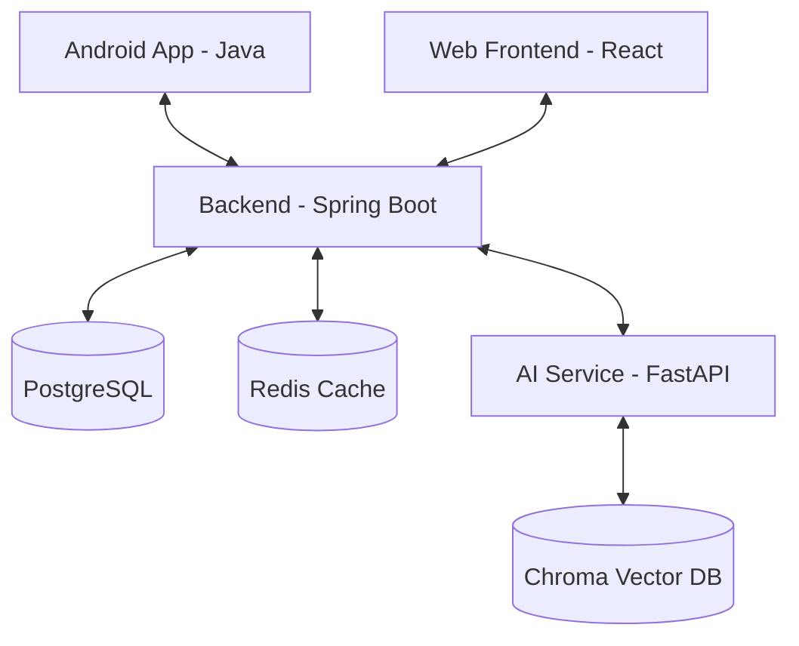

# NovaTicket - Architecture Overview

NovaTicket là hệ thống đặt vé xem phim hiện đại, hỗ trợ đặt vé qua Web và Mobile (Android), tích hợp chatbot AI hỗ trợ thông tin và gợi ý phim.

## 1. High-Level Architecture

Hệ thống được thiết kế theo mô hình **Service-Oriented Architecture (SOA)**, chia tách rõ rệt giữa logic nghiệp vụ cốt lõi và các service bổ trợ (AI).

## 2. Component Details

### 2.1 Backend (Java / Spring Boot)
- **Role**: Trung tâm xử lý logic nghiệp vụ (Auth, Booking, Payment, Management).
- **Tech Stack**: Java 21, Spring Boot 4.0.3+, Spring Data JPA (Hibernate), Spring Security (JWT).
- **Architecture**: Layered Architecture (Controller -> Service -> Repository).
- **Communication**: REST API (Standard JSON), WebClient (Reactive) để gọi AI Service.
- **Migration**: Flyway (đã khai báo dependency nhưng hiện tại đang quản lý schema thủ công - Technical Debt).

### 2.2 AI Service (Python / FastAPI)
- **Role**: Cung cấp khả năng trả lời câu hỏi (RAG) và gợi ý phim dựa trên vector search.
- **Tech Stack**: Python 3.x, FastAPI, LangChain, ChromaDB.
- **Architecture**: Mô hình Ingestion/Agent.
- **Communication**: Chấp nhận yêu cầu từ Backend thông qua internal API key.

### 2.3 Mobile App (Android)
- **Role**: Ứng dụng cho khách hàng cuối.
- **Tech Stack**: Java 17, MVVM, Hilt (DI), Retrofit (Network), Room (Local Cache), Navigation Component.
- **Pattern**: ViewBinding, ViewModel + LiveData.

### 2.4 Web Frontend (React)
- **Role**: Dashboard quản trị và giao diện web cho người dùng.
- **Tech Stack**: React 18, Vite, Tailwind CSS, TanStack Query, Zustand.

## 3. Data Flow

1. **Auth Flow**: Người dùng đăng nhập qua JWT/Google/Facebook -> Backend xác thực -> Trả về Access Token & Refresh Token.
2. **Booking Flow**: Người dùng chọn slot -> Backend lock ghế tạm thời trong Redis (~10p) -> Thanh toán (VNPAY) -> Lưu DB -> Thông báo FCM.
3. **AI Flow**: Người dùng hỏi chatbot trên App -> Backend nhận tin -> Chuyển tiếp sang AI Service kèm Session ID -> AI Service tìm kiếm context trong Vector DB -> Trả về câu trả lời.

## 4. Technical Debt Identification

- **DB Migration**: Flyway chưa được dùng để quản lý schema thực tế, dẫn đến khó khăn khi deploy môi trường mới.
- **Error Handling**: Cần chuẩn hóa cấu trúc lỗi thống nhất giữa Spring Boot và FastAPI.
- **Integration Tests**: Thiếu các bài test tích hợp liên dịch vụ (E2E).
