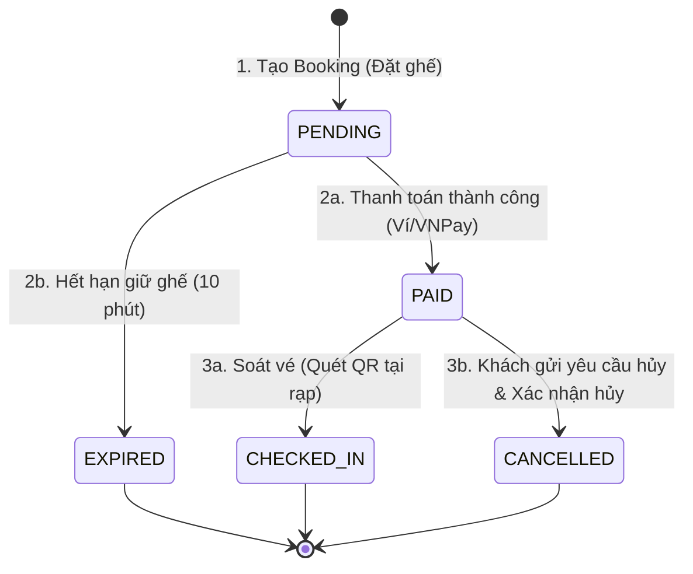

# Hướng dẫn kiểm thử chuyển trạng thái (State Transition) bằng Postman, Newman và Tự động log bug Jira

Tài liệu này hướng dẫn cách thiết kế kịch bản kiểm thử chuyển trạng thái (State Transition Testing), cách chạy test tự động bằng **Newman** và vận hành hệ thống tự động đồng bộ lỗi lên **Jira**.

---

## 🔄 1. Thiết kế kịch bản chuyển trạng thái (State Transition)

Kiểm thử chuyển trạng thái tập trung vào việc xác thực thực thể chính (ở đây là **Booking - Đơn vé**) thay đổi trạng thái đúng logic nghiệp vụ khi có các tác nhân bên ngoài tác động vào (ví dụ: khách đặt, khách thanh toán, admin soát vé, khách yêu cầu hủy).

Trong dự án NovaTicket, thực thể **Booking** được thiết kế chạy qua 3 luồng chuyển trạng thái chính sau:



### Cách tổ chức chuỗi Request liên kết trong Postman
Để kiểm tra luồng trên, Postman Collection được cấu trúc dưới dạng các request chạy liên tiếp. Dữ liệu đầu ra của request trước được lưu vào môi trường (Environment) để làm đầu vào cho request sau:

1.  **Auth Login** $\rightarrow$ Lưu `accessToken` vào biến môi trường.
2.  **Đặt ghế (POST `/bookings`)** $\rightarrow$ Trả về Booking ID & Booking Code. Lưu vào biến `state_booking_id_1` và `state_booking_code_1`.
3.  **Thanh toán (POST `/payments/wallet`)** $\rightarrow$ Truyền `state_booking_id_1`. Trạng thái chuyển từ `PENDING` sang `PAID`.
4.  **Xác nhận trạng thái (GET `/bookings/{id}`)** $\rightarrow$ Sử dụng Assert của Postman để kiểm tra xem trạng thái trả về có đúng là `PAID` hay không:
    ```javascript
    pm.test("Trạng thái đơn vé phải là PAID", function () {
        pm.expect(pm.response.json().data.status).to.eql("PAID");
    });
    ```
5.  **Check-in (POST `/bookings/check-in`)** $\rightarrow$ Sử dụng `state_booking_code_1` để soát vé. Trạng thái chuyển từ `PAID` sang `CHECKED_IN`.

---

## 🚀 2. Chạy kiểm thử tự động bằng Newman

Newman là công cụ CLI giúp chạy Postman Collection trực tiếp trên terminal/môi trường CI/CD.

### Lệnh chạy kiểm thử local:
Di chuyển vào thư mục dự án và chạy:
```bash
newman run qa-tests/postman/NOVATicket_StateTransition.postman_collection.json \
  -e qa-tests/postman/environment/NovaTicket-Local.postman_environment.json \
  --reporters cli,json \
  --reporter-json-export baocaoLocal/postman-report.json
```
*   `-e`: Chỉ định file môi trường chứa biến `BaseUrl`, các secret key, v.v.
*   `--reporters cli,json`: In kết quả ra màn hình dạng bảng và đồng thời xuất ra file báo cáo JSON phục vụ cho việc tự động log bug.

---

## 🚨 3. Cơ chế tự động Log Bug lên Jira khi Test thất bại

Dự án tích hợp script Node.js (`scripts/auto_log_jira_bug.js`) giúp tự động đọc file báo cáo kết quả của Newman và gọi API của Jira để tạo Bug ticket nếu phát hiện bất kỳ testcase nào bị thất bại (FAIL).

### Cách kích hoạt script bằng file Bat:
Nhóm đã tạo sẵn file script chạy toàn bộ quy trình tại thư mục gốc dự án:
```bash
run_local_test.bat
```
Nội dung file bat này sẽ thực hiện:
1. Chạy Newman và xuất báo cáo ra thư mục `baocaoLocal/postman-report.json`.
2. Khởi chạy script: `node scripts/auto_log_jira_bug.js`.

### Logic xử lý thông minh của Script trên Jira:
*   **Phân loại Assignee tự động:** Script phân tích URL của API bị lỗi để tìm ra phân hệ bị lỗi (ví dụ: API chứa `/auth` $\rightarrow$ lỗi thuộc phân hệ Auth $\rightarrow$ assign mặc định cho **Tuấn Võ**).
*   **Chống log trùng (De-duplication):** Trước khi tạo Bug mới, script sử dụng JQL (Jira Query Language) để tìm kiếm xem trên Jira có ticket nào tương tự cho API đó đang MỞ (Status != Done) hay chưa.
    *   *Nếu chưa có:* Tiến hành tạo mới Bug ticket với nhãn `bug` và mức độ ưu tiên `High`.
    *   *Nếu đã có:* Không tạo mới, tiến hành ghi thêm comment minh chứng lỗi mới nhất và tự động chuyển giao (Re-assign) ticket đó cho lập trình viên vừa push code gây lỗi để bắt buộc xử lý.
