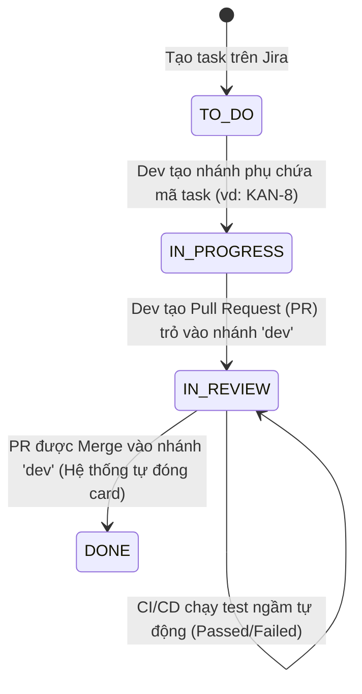

# 📖 Hướng Dẫn Vận Hành Hệ Thống CI/CD & Jira Automation (Dành Cho Team NovaTicket)

Hệ thống của chúng ta đã được tích hợp quy trình **DevOps & QA khép kín chuẩn Enterprise** kết hợp giữa **GitHub Actions**, **Postman/Newman**, và **Jira Cloud**. 

Tài liệu này hướng dẫn tất cả thành viên trong team (Developers & QAs) cách phối hợp, đặt tên nhánh/commit, viết testcase mới và xử lý khi có lỗi xảy ra.

---

## 1. Quy Trình Git Flow & Jira Cloud (Quy Tắc Vàng Cho Developers)

Để hệ thống Jira Cloud nhận diện chính xác các thay đổi và **tự động chuyển trạng thái của Task (Card)** trên Board mà không cần kéo thủ công, mọi người cần tuân thủ quy tắc sau:

### 📌 Quy tắc 1: Đặt tên nhánh (Branch Naming)
Mọi nhánh tính năng (feature branch) được tạo ra từ nhánh `dev` phải chứa **Mã số Ticket Jira (ví dụ: KAN-8, KAN-12)**.
* **Hợp lệ:** `KAN-8`, `feature/KAN-8-setup-cicd`, `bugfix/KAN-12-login-error`
* **Không hợp lệ:** `setup-cicd`, `fix-login-error` (Jira sẽ không liên kết được).

### 📌 Quy tắc 2: Đặt tên Commit (Commit Message)
Trong nội dung commit hoặc tối thiểu là commit cuối cùng trước khi push, **phải chứa mã ticket Jira**.
* **Ví dụ:** `feat(auth): implement login endpoint KAN-8`, `fix(api): fix null pointer exception KAN-12`

### 🔄 Luồng kéo card tự động trên Jira:


---

## 2. Quy Trình Chạy Kiểm Thử Tự Động (CI/CD Pipeline)

Mỗi khi có một **Pull Request** trỏ vào nhánh `dev` hoặc `main`, hệ thống GitHub Actions sẽ tự động kích hoạt tiến trình kiểm thử:

1. **Khởi tạo môi trường ảo sạch 100%:** Khởi chạy một container database **PostgreSQL ảo (có sẵn extension pgvector)** và một container **Redis ảo**.
2. **Khởi động Spring Boot:** Build dự án Backend và chạy ngầm server Spring Boot trên cổng `8080`.
3. **Flyway Database Migration:** Tự động chạy tất cả file SQL migration trong thư mục `db/migration` để dựng cấu trúc bảng và nạp sẵn dữ liệu mẫu (seed data).
4. **Newman API Testing:** Sử dụng công cụ Newman chạy bộ sưu tập API test Postman được lưu trong thư mục `qa-tests/postman/`.

---

## 3. Cơ Chế Tự Động Log Bug Lên Jira (Dành Cho Cả Team)

Nếu tiến trình Newman phát hiện có bất kỳ testcase API nào bị **Fail (Lỗi)**, script NodeJS thông minh (`scripts/auto_log_jira_bug.js`) sẽ tự động chạy:

### 🛡️ Cơ chế chống trùng rác (De-duplication):
Script sẽ tự động quét cột **Jira Board** xem đã có ticket Bug nào tương tự đang mở (chưa được giải quyết) hay chưa. 
* Nếu **đã có** ➔ Bỏ qua (không tạo thêm bug mới để tránh làm loãng Board).
* Nếu **chưa có** ➔ Tự động tạo một ticket **Bug** mới với độ ưu tiên **High**.

### 👤 Phân chia trách nhiệm kiểm thử (Tester):

| Phân Hệ API | Thành Viên Chịu Trách Nhiệm kiểm thử API |
| :--- | :--- |
| **`/api/v1/auth/*`** | 👤 **Nguyên Vũ** (Auth & Security) |
| **`/api/v1/movies/*`**, **`/genres/*`** | 👤 **Minh Triết** (Phân hệ Phim) |
| **`/api/v1/cinemas/*`**, **`/screens/*`** | 👤 **Minh Thắng** (Rạp & Phòng chiếu) |
| **`/api/v1/bookings/*`**, **`/check-in/*`**| 👤 **Minh Trí** (Đặt vé & Check-in) |
| **`/api/v1/payments/*`** | 👤 **Duy Tuấn** (Thanh toán & Ví) |
| **Các API tiện ích / Khác** | 👤 **Nhật Bình** (Hệ thống chung) |

---

### 👤 Phân chia trách nhiệm tự động (Assignee Auto-Allocation):
Bug sẽ tự động được gán (Assign) trực tiếp cho thành viên chịu trách nhiệm phân hệ đó dựa trên URL của API bị lỗi:

| Phân Hệ API | Thành Viên Chịu Trách Nhiệm fix BUG |
| :--- | :--- |
| **`/api/v1/auth/*`** | 👤 **Duy Tuấn** (Auth & Security) |
| **`/api/v1/movies/*`**, **`/genres/*`** | 👤 **Minh Trí** (Phân hệ Phim) |
| **`/api/v1/cinemas/*`**, **`/screens/*`** | 👤 **Nhật Bình** (Rạp & Phòng chiếu) |
| **`/api/v1/bookings/*`**, **`/check-in/*`**| 👤 **Minh Thắng** (Đặt vé & Check-in) |
| **`/api/v1/payments/*`** | 👤 **Minh Triết** (Thanh toán & Ví) |
| **Các API tiện ích / Khác** | 👤 **Nguyên Vũ** (Hệ thống chung) |

---

## 4. Hướng Dẫn Cho QA/Devs: Cách Viết & Cập Nhật Testcase Mới

Khi có thêm API mới hoặc muốn cập nhật kịch bản kiểm thử, các bạn làm theo các bước sau:

### 📥 Bước 1: Viết testcase trên Postman
1. Mở Postman local, import file collection [NOVATicket.postman_collection.json](file:///.../qa-tests/postman/NOVATicket.postman_collection.json) và file môi trường [NovaTicket-Local.postman_environment.json](file:///.../qa-tests/postman/NovaTicket-Local.postman_environment.json).
2. Viết thêm các request kiểm thử kèm các đoạn mã assertion trong tab **Tests** của Postman (ví dụ kiểm tra status 200, 201, cấu trúc JSON trả về...).

### ⚠️ Bước 2: Lưu ý cực kỳ quan trọng về Environment Variables khi Export
Do Postman khi Export file cấu hình môi trường chỉ xuất cột **Initial Value (Giá trị ban đầu)** và xóa cột **Current Value**:
* **BẮT BUỘC:** Bạn phải điền giá trị `http://localhost:8080` vào ô **Initial Value** của biến **`BaseUrl`** trước khi Export file Environment! Nếu để trống ô này, CI/CD trên GitHub sẽ bị crash vì không nhận dạng được URL gọi API.

### 📤 Bước 3: Lưu đè và Commit lên Git
1. Export file Collection JSON đè lên file cũ tại: `qa-tests/postman/NOVATicket.postman_collection.json`.
2. Export file Environment JSON đè lên file cũ tại: `qa-tests/postman/NovaTicket-Local.postman_environment.json`.
3. Mở Terminal và commit push lên nhánh tính năng của bạn:
   ```bash
   git add qa-tests/postman/
   git commit -m "test(qa): add testcases for new booking api KAN-XX"
   git push origin <tên-nhánh-của-bạn>
   ```

---
